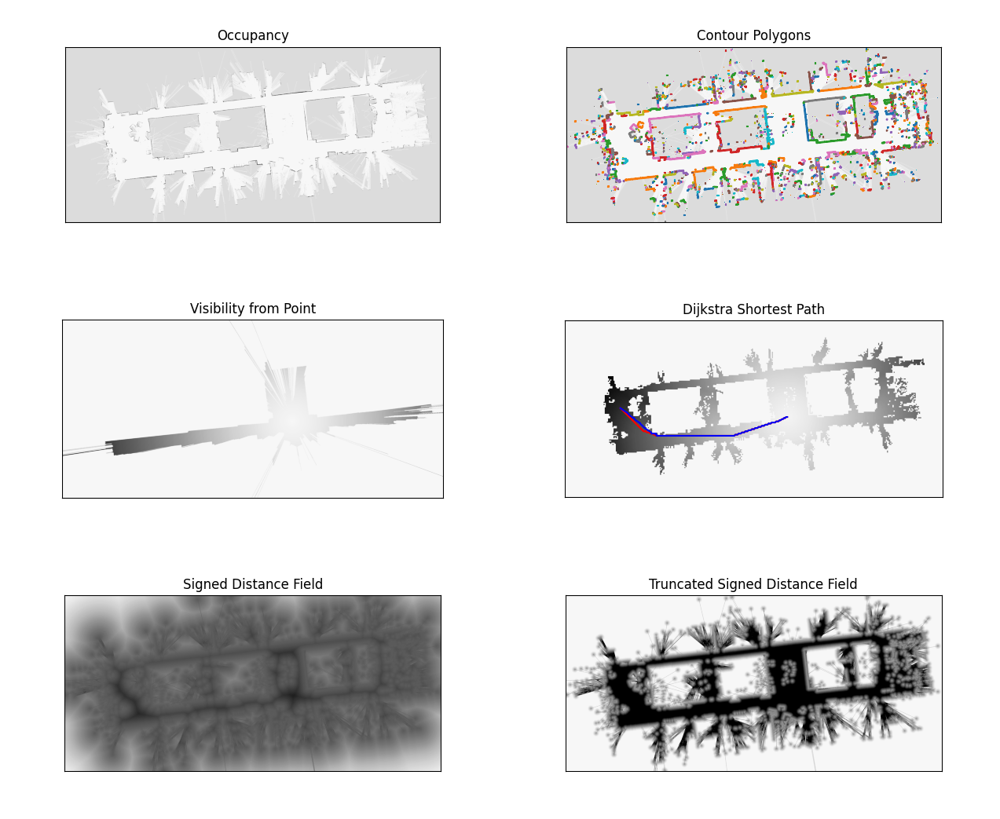

# pymap2d

pymap2d is a Cython-based fast toolbox for 2d grid maps.

The CMap2D class provides:
- simple xy <-> ij coordinate conversions
- implementation of the dijkstra / fastmarch algorithm
- fast 2D distance transform (ESDF)
- conversions:
  - to/from polygon vertices
  - from ROS occupancy map or lidar scan message
  - serialization to/from dict



Note: rather than carefully designed, this codebase was chaotically grown. 
It is in dire need of refactoring / documentation. I hope it still proves useful.

## Dependency: Cython
```
$ pip install numpy Cython
```

## Installation:
Inside this project root folder:
```
$ pip install pymap2d
```

## How to

Creating a map

```python
from CMap2D import CMap2D

# empty map
mymap = CMap2D()

# from a pgm file
mymap = CMap2D("folder", "filename")

# from a ROS message
mymap.from_msg(msg)
```

Accessing occupancy data, origin, resolution (read-only)

```python
# occupancy as 2d array
mymap.occupancy()

# origin: (x, y) coordinates of point (i, j) = (0, 0)
mymap.origin_xy()

# resolution: size of grid cell [meters]
mymap.resolution()
```

Converting between grid and spatial coordinates

```python
list_of_xy_points = np.array([[1.3, 2.3], [-1.1, -4.0], [6.4, 2.3]])

in_ij_coordinates = mymap.xy_to_floatij(list_of_xy_points)
as_indices = mymap.xy_to_ij(list_of_xy_points, clip_if_outside=True)
```

gridshow is a convenience function, which wraps plt.imshow to intuitively visualize 2d array contents.
It makes the first array dimension x axis and uses grayscale by default.

```python
from CMap2D import gridshow
gridshow(mymap.occupancy())
```


For more examples, see tests/example_*.py
